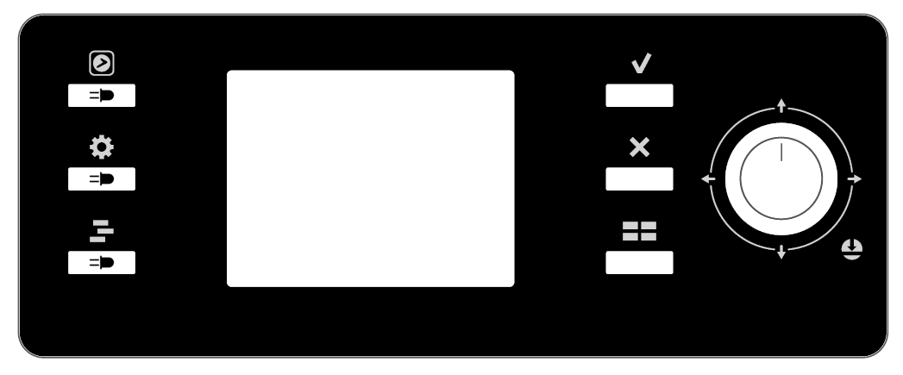
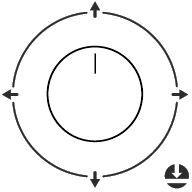
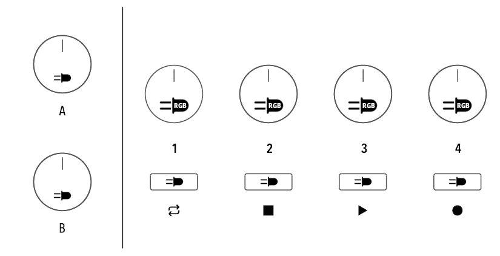
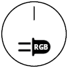
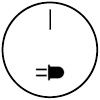

# Hardware I/O

In this section, we focus on input/output messages to and from the machine's hardware.  
Specifically, we refer to the control of LEDs, Encoders, and buttons.

## The SL mk2 Layout

Before proceeding, a brief presentation of the SL mk2 panel layout, illustrating all the leds and controls available.   
We indicate with  the presence of an LED in correspondence with a button or an encoder.

The lcd panel appear as follows:

| Symbol | Name | Description |
| :---: | :---: | ----- |
|  | **App** | The button that the user presses to enter in SL-Link mode. For this reason it is not available to the Device. |
|  | **Global** | Global button. With LED. |
|  | **Daw** | Daw button. With LED. |
|  | **Apply** | Apply button |
|  | **Cancel** | Cancel Button |
|  | **Home** | Home button. When the SL mk2 is not in SL-Link mode, this button goes back to the main screen. It is recommended to use this in a similar way. |
|  | **Joystick** | The Joystick has a builtin encoder and five buttons: one for each direction plus a central main one. |

On the left of the LCD we have the control section, composed by six encoders and four buttons:

| Symbol | Name | Description |
| :---: | :---: | ----- |
|  | **Zone Encoder** | These are encoders with a built-in push button and RGB LED. The encoders are numbered from one to four. |
|  | **A/B Encoder** | Like the previous ones, these have a built-in push button, but are equipped with a White LED. |
|  | **Zone buttons** | These are simple push buttons numbered from one to four, equipped with a White LED. |

## Hardware I/O messages

The SL-Link protocol allows the Device to receive user interactions with the keyboard’s controllers and provide instant feedback through the activation and coloring of the LEDs on the SL mk2 panel.

In this chapter, unlike the previous ones, each message is assigned with its own **ItemType**.

We present a brief list of the messages presented in this chapter with the direction of each:

| System Message | ItemType | Direction |
| :----- | :---: | :-----: |
| LED message | `0x02` | Host → SL |
| RGB LED message | `0x05` | Host → SL |
| Encoder message | `0x03` | Host ← SL |
| Button message | `0x01` | Host ← SL |
| Hardware Settings message | `0x06` | Host ↔ SL |
| Master Volume message | `0x07` | Host ↔ SL |

## LEDs Message

The SL mk2 has 17 LEDs, 4 of which are RGB LEDs (those corresponding to the four zone encoders), 12 are white LEDs (corresponding to buttons and the A and B encoders), and the last one is a red LED that is not controllable via SL-Link.

While the white LEDs can only be turned on or off, the RGB ones can be colored as desired and their brightness can vary.

### LED White Message

The white LEDs are the ones associated with the buttons and the A and B encoders.  
The message to control them has the **ItemType** set to `0x02`, contains one byte to identify the LED to be controlled, and  another byte to set its state (on or off).

The message it’s structured as follows:

| `F0 00 20 1A 16 HID DID` | `0x02` | WLID | LST | `F7` |
| :---: | :---: | :---: | :---: | :---: |
| Header | ItemType | LED ID | LED state |  |

where:

- **WLID**:  LED identification number, see the table on the right.  
- **LST**: Led state, 0 \= off, 1 \= on.

| WLID | Corresponding LED |
| :----: | :---- |
| `0x00` | Zone 1 button LED |
| `0x01` | Zone 2 button LED |
| `0x02` | Zone 3 button LED |
| `0x03` | Zone 4 button LED |
| `0x04`**?** | APP button LED**?** |
| `0x05` | Apply button LED |
| `0x06` | Cancel button LED |
| `0x07` | Home button LED |
| `0x08` | Global button LED |
| `0x09` | DAW button LED |
| `0x0A` | A encoder LED |
| `0x0B` | B encoder LED | 

### LED RGB Message

The RGB LEDs are associated with the four zone encoders ( the ones labeled from 1 to 4).

Each LED is made up of three sub-LEDs, one for each primary color (Red, Green and Blue), that can be controlled with one single message, using the color coding discussed in the Display chapter, section [About the Colors](./display-messages.md#about-the-colors).

Moreover each RGB LED has an adjustable brightness that affects all of the three sub-LEDs.

The associated **ItemType** for the RGB LED message is `0x05`.  
The RGB LED is selected via **LID** byte ( ranging from 0 to 3 ), the color is set via the **R**, **G**, and **B** bytes while the brightness is controlled with the **BR** byte (ranging from 0 to 127):

| `F0 00 20 1A 16 HID DID` | `0x05` | LID | R | G | B | BR | `F7` |
| :---: | :---: | :---: | :---: | :---: | :---: | :---: | :---: |
| Header | ItemType | RGB LED ID | Color Red | Color Green | Color Blue | LED brightness |  |

where:

- **LID**: Identify the RGB LED to act on, goes from 0 to 3
- **R**: Red color intensity
- **G**: Green color intensity
- **B**: Blue color intensity
- **BR**: The brightness of the whole RGB LED

## Encoder Message

There are a total of 7 encoders on the SL mk2. The Host Device can receive messages from all of them, except from the encoder labeled A on the SL, which controls the overall volume of the USB audio.

The Encoder Messages flow only from the SL mk2 to the Host Device, and must be handled by the recipient.  
It has the **ItemType** bit set to `0x03`, the encoders are indexed by the **EID** byte, and the encoder rotation is stored in the **TK** byte:

| `F0 00 20 1A 16 HID DID` | `0x03` | EID | TK | `F7` |
| :---: | :---: | :---: | :---: | :---: |
| Header | ItemType | Encoder ID | Tick value |  |

where:

- **EID**: Encoder ID, identify the encoder that sent the message, see the table above.
- **TK**: Tick value, stores the rotation value of the encoder.

| EID | Encoder label |
| :----: | :---- |
| `0x00` | Zone 1 Encoder |
| `0x01` | Zone 2 Encoder |
| `0x02` | Zone 3 Encoder |
| `0x03` | Zone 4 Encoder |
| `0x04` | Joystick Encoder |
| `0x05` | A Encoder |
| `0x06` | B Encoder |

It is important to note that encoders do not send absolute values but rather relative ones.  
When turned clockwise, they send "positive ticks"; conversely, when turned counterclockwise, they send "negative ticks".

The speed at which the encoder is rotated will produce a larger gap in values, for example, \+2, \+3, or \-2, \-3.

Moreover, the tick value is 64-centered, meaning that the negative values are all the ones inferior to `0x40`, while the positive ones are above this value.

## Button Message

Like the Encoder Messages, Button Messages can flow only from the SL mk2 to the Host Device.

There are a total of 21 buttons, including one push-buttons integrated in each encoder (7 in total), plus four directions of the Joystick Encoder.

The APP button is reserved in order to allow the user to go back to the Control Mode of the SL mk2, and the A Encoder Button is reserved for the USB audio mute/unmute function, leaving the Host Device with the chance to control a total of 19 buttons.

The Button Message has the **ItemType** bit set to `0x01`, the buttons are indexed by the **BID** byte, and the encoder rotation is stored in the **EVT** byte.

The Buttons can handle two types of events, called SHORT\_PRESSION (**EVT** \= `0x01`), and LONG\_PRESSION (**EVT** \= `0x02`).  
If one Button is pressed for more than one second, a LONG\_PRESSION event is sent, while if the pression lasts for less than a second it will send a SHORT\_PRESSION event on its release.The Button Message is structured as follows:

| `F0 00 20 1A 16 HID DID` | 0x01 | BID | EVT | `F7` |
| :---: | :---: | :---: | :---: | :---: |
| Header | ItemType | Button ID | Event type |  |

where:
- **BID**: Button ID, identify the Button that sent the message, see the table on the right.  
- **EVT**: Event value

| BID | Corresponding Button |
| :----: | :---- |
| `0x00` | Zone 1 Encoder Button |
| `0x01` | Zone 2 Encoder Button |
| `0x02` | Zone 3 Encoder Button |
| `0x03` | Zone 4 Encoder Button |
| `0x04` | Zone 1 select Button |
| `0x05` | Zone 2 select Button |
| `0x06` | Zone 3 select Button |
| `0x07` | Zone 4 select Button |
| `0x09` | Global Button |
| `0x0A` | DAW Button |
| `0x0B` | A Encoder Button |
| `0x0C` | B Encoder Button |
| `0x0E` | Apply Button |
| `0x0F` | Cancel Button |
| `0x10` | Home Button |
| `0x11` | Joystick Up Button |
| `0x12` | Joystick Left Button |
| `0x13` | Joystick Down Button |
| `0x14` | Joystick Right Button |
| `0x15` | Joystick Main Button |

## About the MIDI pedals

The SL mk2 is equipped with three pedal inputs, each of which allow different configurations for compatibility with the current hardwares available on the market.  
The different configurations can be only modified in the SL mk2 Global Configuration, accessible by pressing the Global button while the SL mk2 is in the default Control Mode.

There are six types of pedals supported by the SL mk2, two switch pedals (SwitchA and SwitchB), two expression pedals (ContinuousA and ContinuousB) and the special Studiologic SLP-3D (piano pedal unit).  
Each pedal input is compatible with a subset of these type of pedals according to the next table:

| Pedal Input | SwitchA | SwitchB | ContinuousA | ContinuousB | SLP-3D |
| :---- | :---: | :---: | :---: | :---: | :---: |
| Pedal 1 | ✅ | ✅ |  |  |  |
| Pedal 2 | ✅ | ✅ | ✅ | ✅ |  |
| Pedal 3 | ✅ | ✅ | ✅ | ✅ | ✅ |

As pointed before, each pedal type can be selected in the Global Settings Menu.  
These settings are not modifiable by the Device, but can be inquired via the proper Pedal message, discussed in the next section.

Unlike the previous ones, the messages generated by these pedals are not SysEx messages, but Channel Voice messages sent in the common channel 0\.  
In case a Pedal is set as a Switch, the relative Channel Voice messages will assume only the value `0x00` ( \= OFF ) and `0x7F` ( \= ON ).  
The next table illustrates the messages sent by each pedal.   
For convenience also the messages sent by the two sticks are included:

| Controller | Status Byte | CC Data Byte |
| :---- | ----: | ----: |
| Stick 1 X axis | Pitch Bend `0xE0` | |
| Stick 1 Y axis | Control Change `0xB0` | CC General Purpose 0 `0x10` |
| Stick 2 | Control Change `0xB0` | CC Modulation `0x01` |
| Pedal 1 | Control Change `0xB0` | CC Damper pedal `0x40` |
| Pedal 2 | Control Change `0xB0` | CC Expression `0x0B` |
| Pedal 3 Normal mode | Control Change `0xB0` | CC General Purpose 1 `0x11` |
| Pedal 3 special left  | Control Change `0xB0` | CC Soft Pedal `0x43` |
| Pedal 3 special center | Control Change `0xB0` | CC Sostenuto `0x42` |
| Pedal 3 special right | Control Change `0xB0` | CC Damper pedal `0x40` |

### Hardware Settings Message

This message allows the Device to inquire the SL about the current pedal settings:

| `F0 00 20 1A 16 HID DID` | `0x06` | HST | `F7` |
| :---: | :---: | :---: | :---: |
| Header | ItemType | Hardware Status |  |

It’s a two way message: the Device sends this message to know from the keyboard what is the status of the Pedal Type settings, and the SL mk2 responds with the same message, with the requested info packet in the **HST** byte (Hardware Status).

In the message flowing from the Device to the SL mk2 the **HST** byte can assume any value, and actually it can also be totally omitted.  
Instead, in the SL mk2 answer, the **HST** byte contain all the required informations.

Each Pedal is represented by a group of bits in the **HST** byte, according to the next table:

| Pedal | HST bits | HST Bit Mask |
| :---- | :----- | :-----: |
| Pedal 1 | bit 6 | `0b 0010 0000` |
| Pedal 2 | bit 4, bit 5 | `0b 0001 1000` |
| Pedal 3 | bit 0 to 2 | `0b 0000 0111` |

Moreover the meaning of each bit subgroup is illustrated in the following (with the interested bits highlighted and with x representing any value):

| Pedal | HST | Bit Mask |
| :---- | :---: | :----- |
| Pedal 1 | `0b 000x xxxx` | Pedal 1 SwitchA |
| Pedal 1 | `0b 001x xxxx` | Pedal 1 SwitchB |
| Pedal 2 | `0b 00x0 0xxx` | Pedal 2 ContinuousA |
| Pedal 2 | `0b 00x0 1xxx` | Pedal 2 ContinuousB |
| Pedal 2 | `0b 00x1 0xxx` | Pedal 2 SwitchA |
| Pedal 2 | `0b 00x1 1xxx` | Pedal 2 SwitchB |
| Pedal 3 | `0b 00xx x000` | Pedal 3 ContinuousA |
| Pedal 3 | `0b 00xx x001` | Pedal 3 ContinuousB |
| Pedal 3 | `0b 00xx x010` | Pedal 3 SwitchA |
| Pedal 3 | `0b 00xx x011` | Pedal 3 SwitchB |
| Pedal 3 | `0b 00xx x1xx` | Pedal 3 SP3-D |

We recall that when a pedal is in Switch mode, it will send only two values of its Channel Voice message: `0x00` representing an OFF value and a `0xF7` representing an ON value.

### Master Volume message

To control the audio board volume a Master Volume message is provided.

| `F0 00 20 1A 16 HID DID` | `0x07` | R/W | VOL | MUTE | `F7` |
| :---: | :---: | :---: | :---: | :---: | :---: |
| Header | ItemType | Read/Write | Volume | Mute |  |

The message is sent by the Device to the SL mk2, and can be either in a read or write form.
In both ways, the MUTE byte contains information the mute status of the audio board, while the VOL one specify the volume of the board.

If the Device performs a write the R/W byte must be set to 1.
Every value of MUTE byte different from zero will activate the mute status of the audio board, while sending a MUTE value of zero will unmute the board.
The VOL byte can take any decimal value between 0 and 100, corresponding to a volume from 0% to 100%. If the SLMK2 receive a value greater than 100 this will be ignored.
This can be useful if you just need to operate on the MUTE byte without overwriting the current stored volume.
For retrocompatibility the MUTE byte can be omitted.

If the Device send a read message the R/W byte is set to 0 and the VOL byte can be omitted.
The SL mk2 will answer with a read message (byte R/W set to zero) with the VOL byte containing the current audio board volume and the MUTE one containing the mute/unmute status (respectively 1 or 0).

[Back to index](../README.md)