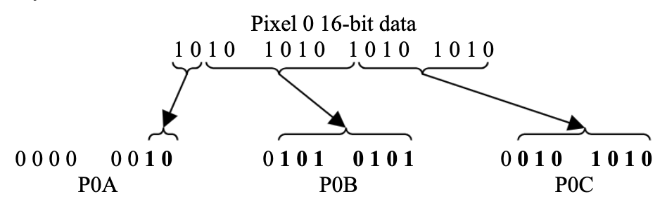

# System Messages

## Structure

Every System Message is identified by the ItemType byte set to `0x00` and each one is distinguished by the **Function** byte.

| `F0 00 20 1A 16 HID DID` | `0x00` | Function | *...message...* | `F7` |
|:---:|:---:|---|---|---|
| Header | ItemType | | | |

Some of the System Messages can flow in only one direction, while others can go in both direction.  
The System Messages , along with their corresponding Function byte, are as follows:

| System Message | Function byte | Direction |
|:---|:---:|:---:|
| System Login Request | `0x00` | Device → SL |
| System Login Confirmation | `0x01` | Device ← SL |
| System Logout Request | `0x02` | Device ↔ SL |
| System Logout Confirmation | `0x03` | Device ↔ SL |
| System Standby | `0x04` | Device ← SL |
| System Restart | `0x05` | Device ← SL |
| System Login Recall | `0x06` | Device ← SL |
| System Send Icon | `0x07` | Device → SL |
| System Icon Ack | `0x08` | Device ← SL |
| System Icon Nack | `0x09` | Device ← SL |

## Login and logout dynamics

System Messages establishes the connection and disconnection policy between the SL-MKII and the remote device. This message serves a dual purpose and can be both sent and received.

The Device is responsible for the first communication with the keyboard, and do this via a *System Login Request Message*.  
The Device then becomes visible in the list of available apps in the proper section of the SL mk2.  
When the user selects the Device from the list, one of two messages between  *Login Confirmation* or *Login Recall* is sent from the SL mk2 to the Device (Function `0x01` or `0x06`).  
The former becomes now available to receive and reply to the other types of messages.  
The difference between the two login response messages will be explained later.

When the user exits from the SL-Link Mode on the keyboard, the latter sends a *System Logout Request Message*.  
The Device should now suspend all the further messages and promptly send a *System Logout Confirmation Message* before ceasing all the activities.

The same messages, but reversed are exchanged when the Device needs to permanently stop the communication with the SL mk2.  
In this case will be the Device to send a *System Logout Request Message* and the keyboard to reply with a *System Logout Confirmation Message*.

### System Login message
| `F0 00 20 1A 16 HID DID` | `0x00`| `0x00` | S(1)	... S(N) | `0x00` | `F7` |
|:---:|:---:|:---:|:---:|:---:|:---:|
| Header | ItemType | Function | Identification String | String terminator | |

With this message the remote device requests SL-MKII to appear in the list of  *Available Apps* accessible through the ***APP*** button.

Each message must contain an identification string, represented by S(N) ASCII bytes, along with its string terminator (`\0` = `0x00`).  
This string will uniquely identify the sending device in the above mentioned list, and has a maximum length of  32 bytes.

**Note**: This message needs to be sent continuously, for example, every 1 or 2 seconds, also after a *System Login Confirmation* or a *System Login Recall* message is received.  
If the message is no longer received by SL-MKII, after a certain time (5 seconds), the APP is removed from the list.

### System Login Confirmation

The following is one of the two responses to the *System Login Message*:

[//]: # (| `F0 00 20 1A 16 HID DID` | `0x00` | `0x01` | MAJ MIN REV | SL | `F7` |)
[//]: # (|:---:|:---:|:---:|:---:|:---:|:---:|)
[//]: # (| Header | ItemType | Function | Firmware Version | SL Model | |)

<table>
<thead>
<tr>
<th align="center"><code>F0 00 20 1A 16 HID DID</code></th>
<th align="center"><code>0x00</code></th>
<th align="center"><code>0x01</code></th>
<th align="center">MAJ</th>
<th align="center">MIN</th>
<th align="center">REV</th>
<th align="center">SL</th>
<th align="center"><code>F7</code></th>
</tr>
</thead>
<tbody><tr>
<td align="center">Header</td>
<td align="center">ItemType</td>
<td align="center">Function</td>
<td colspan="3" align="center">Firmware Version</td>
<td align="center">SL Model</td>
<td></td>
</tr>
</tbody>
</table>

It’s important to understand that this message is only sent when the user, once in APP mode, selects the device to activate the interaction with it.

Moreover this message implies that the keyboard has not stored any icon representing the Device and that this image could be provided (more on that in the [Device Icon Mechanism](#device-icon-mechanism) section).

The message contains the current version of the firmware that is responding to the Device, with the bytes MAJ MIN and REV respectively containing the Major, Minor and Revision version.
Moreover the SL byte contains the type of SL that is accepting the login request, coded as follows:
| SL byte | SL model |
|:---:|:---|
| `0x00` | SL88 GT |
| `0x01` | SL88 |
| `0x02` | SL73 |

Upon receiving this value, the Device should proceed to refresh the display with its contents and can choose to send a personalized icon.

### System Logout Request Message

The Device can request to be removed from the APP list by sending the following message:

| `F0 00 20 1A 16 HID DID` | `0x00` | `0x02` | `F7` |
|:---:|:---:|:---:|:---:|
| Header | ItemType | Function | |

In response, the SL will send a *System Logout Confirmation Message*.

In addition, this same message is sent by the SL when the user logout from the current Device, moving to another Device or reverting to the normal use of  the keyboard as a controller.

When receiving this message, the APP should suspend sending messages and respond with *System Logout Confirmation Message*, described in the following section.

### System Logout Confirmation Message

| `F0 00 20 1A 16 HID DID` | `0x00` | `0x03` | `F7` |
|:---:|:---:|:---:|:---:|
| Header | ItemType | Function | |

The SL sends this message as a response to the *System Logout Request Message* sent by the Device.

In the same way the Device sends this message promptly after receiving a *System Logout Request Message* from the SL (mainly when the user long-press the ***APP*** button while connected to the Device), and then stops to send messages other than *System Login Request Message*, in order to maintain its name in the list of the available apps.

### System Standby Message

| `F0 00 20 1A 16 HID DID` | `0x00` | `0x04` | `F7` |
|:---:|:---:|:---:|:---:|
| Header | ItemType | Function | |

The System Standby Message is sent from the SL mk2 to the Device when the user presses the SL-Link button to go back to the normal midi control behavior of the keyboard.

This message implies that the Device is still logged into the SL mk2, but it has to cease to send messages (although all the SL-Link messages received in this state will be ignored).

### System Restart Message

| `F0 00 20 1A 16 HID DID` | `0x00` | `0x05` | `F7` |
|:---:|:---:|:---:|:---:|
| Header | ItemType | Function | |

This message means that the user returned to the SL-Link mode on the keyboard, and that the Device, that is still logged in the keyboard, can now take control again of the SL mk2.

The *System Restart Message* is always preceded by a *System Standby Message* at some point in time.

It’s important to know that the keyboard does not store any information about the status of the Device when the *System Standby Message* is received, so it’s up to the Host to remember it.  
This concerns also the Screen, that has to be fully repopulated by the Device.

### System Login Recall

This is the second response to the *System Login Message*:

[//]: # (| `F0 00 20 1A 16 HID DID` | `0x00` | `0x06` | MAJ MIN REV | `SL` | `F7` |)
[//]: # (|:---:|:---:|:---:|:---:|)
[//]: # (| Header | ItemType | Function | |)
<table>
<thead>
<tr>
<th align="center"><code>F0 00 20 1A 16 HID DID</code></th>
<th align="center"><code>0x00</code></th>
<th align="center"><code>0x06</code></th>
<th align="center">MAJ</th>
<th align="center">MIN</th>
<th align="center">REV</th>
<th align="center">SL</th>
<th align="center"><code>F7</code></th>
</tr>
</thead>
<tbody><tr>
<td align="center">Header</td>
<td align="center">ItemType</td>
<td align="center">Function</td>
<td colspan="3" align="center">Firmware Version</td>
<td align="center">SL Model</td>
<td></td>
</tr>
</tbody>
</table>

This message has the same function of the *System Login Confirmation Message*: as the previous one is sent when the user selects the device on the Device List to activate the interaction with it.

The difference is that this message implies that an icon is already stored for the given (*HostID*, *DeviceID*) couple, meaning that the Device no longer needs to send it (unless he wants to replace it).

As the *System Login Confirmation Message*, this one contains the firmware version and the SLMK2 keyboard model that is accepting the login.


## Device Icon mechanism

The SL mk2 gives each device the space to store one icon in its RAM.

The size of the icon must be 32x32 pixels, coded in 16 bit 565 color format, and only the raw data must be sent to the keyboard, meaning that no image headers must be included in the messages.

The icon will be sent in packets of two rows: 64 pixels at time or 128 byte of data per message, meaning that a total of 16 messages are needed for the complete transfer to occur.

Due to the MIDI protocol format, the 128 byte of information will be spread on 192 byte for each packet, we will explain this in the [System Send Icon Message](#system-send-icon-message) section.

Each packet is numbered from 0 to 15, and must be sent in ascending order.  
After each transfer the SL mk2 will send a *System Icon Ack Message* that will include the packet number to which the Ack Message refers to.  
After receiving the Ack message the Device can proceed to send the next *System Send Icon Message* with an incremented packet number.  
The transfer will be completed when a *System Send Icon Message* is sent with a packet number of 15 with a *System Icon Ack* response including the same packet number.

Each transfer message can be sent at any time, and the SL mk2 will store as an internal value the Packet Number it expects to receive, ignoring any message with a higher packet number and overwriting the data already present if a message with a lower packet number is sent.  
One exception to this mechanism is that a successful *System Send Icon Message* with a packet number of zero will always reset the internal status, causing the keyboard to expect a *System Send Icon Message* with a packet number of 1.

If something goes wrong, the keyboard sends a *System Icon Nack Message* that will include the packet number that the SL mk2 is awaiting.

Although its designed to store a single personal Device logo, these mechanics allow the sending of different icons during the interaction with the SL mk2, but one must remember that only one image is stored at time (so sending a new one will overwrite the old one), and that the SL mk2 does not store any information about the icon other than the raw pixel data, meaning that the Device is responsible of keeping track of the icon present in the keyboard RAM.  
Moreover it must be known that the estimated time for a complete icon transfer is measured between 50 to 70 milliseconds, that is a heavy burden for the keyboard, but on the other hand the transfer mechanics give to the Device a fair control on how much data to send and when.

After receiving all the data, the SL mk2 stores the icon in association with the (*HostID*, *DeviceID*) couple, and will remember it also after a Logout is performed or even a timeout occurs.  
The image can then be printed on screen via a [*Plot Device Icon message*](plot-device-icon-message) (see the [Display Messages](./display-messages.md) section).  
The SL mk2 is capable of storing 1 icon per Device for a total of 10 Devices, and will forget about an image in three ways:

1.	When the keyboard is turned off by the user.
2.	When another Device sends a *System Login Message*, the current Device has been removed from the list due to a time-out and no other slots are free.
3.	When a new icon is sent via a *System Send Icon Message* with packet number of zero.

### System Send Icon Message

| `F0 00 20 1A 16 HID DID` | `0x00` | `0x07` | PNUM | `P0A P0B P0C`, `P1A P1B P1C`, ... | `F7` |
|:---:|:---:|:---:|:---:|:---:|:---:|
Header | ItemType | Function | Packet Num | Pixel 0 data, Pixel 1 data, ... |
| | | | | 64 Pixels / 194 bytes | |

This is the message used to transfer the 565 color data of the Device’s Logo.

As said before, the device has the possibility to temporarily store a 32x32 Logo in the SL mk2 RAM, and must transfer it via 16 packets of two rows each (64 pixels per transfer).

The *PNUM* (Packet Number) byte, indicates what slice of the Logo is sent in the current message.  
A PNUM of zero, starts a new Logo transfer and tells the SL mk2 to overwrite any existing image associated with the (*HostID*, *DeviceID*).

The SL mk2 will then answer with a System Icon Ack message, reporting the PNUM that has just been received.  
The Device is then able to send the next packet (PNUM = `1`), and the cycle repeats.

Particular care must be taken in preparing the Logo’s data in the SysEx message.  
As mentioned above, the MIDI standard requires the Most Significant Bit of all the data bytes to be set to zero, actually reducing the information stored in one byte to 7-bit.

This forces us to encapsulate our 16-bit 565 format in a three byte format.  
Taking as an example the first pixel of the image P0, the top left one, we will store its two most significant bits in the P0A byte, the next seven bits in the P0B byte and the seven least significant bits in the P0C byte.



A convenient function to convert from 16-bit format to 3-byte MIDI data format is given:

```
struct Pixel3Byte
{
    Pixel3Byte(uint8_t a, uint8_t b, uint8_t c) : A(b), B(a), C(c) {}

    uint8_t A = 0;
    uint8_t B = 0;
    uint8_t C = 0;
};

Pixel3Byte convertPixel(uint16_t pixel_data) {
    uint8_t a = pixel_data>> 14;
    uint8_t b = (pixel_data >> 7) & 0x7F;
    uint8_t c = pixel_data & 0x7F;
    return Pixel3Byte(a, b, c);
}
```

The message data starts with the first pixel of the considered row (which is the (PNUM*2+1)-th row), proceed with the 32 pixel of that row (from left to right) and then continue with the 32 pixels of the second row (the (PNUM*2+2)-th row) in the same way.

### System Icon Ack Message

| `F0 00 20 1A 16 HID DID` | `0x00` | `0x08` | PNUM | `F7` |
|:---:|:---:|:---:|:---:|:---:|
| Header | ItemType | Function | Packet Number | |

This message is sent from the SL mk2 to the Device after a *System Send Icon Message* is successfully received by the keyboard.

Upon receiving this message, the Device can send the next slice of icon, namely a *System Send Icon Message* with a Packet Number of PNUM+1.

The Device does not have to answer immediately, but can time the *System Send Icon Messages* as its convenience.

### System Icon Nack Message

| `F0 00 20 1A 16 HID DID` | `0x00` | `0x09` | PNUM | `F7` |
|:---:|:---:|:---:|:---:|:---:|
| Header | ItemType | Function | Packet Number | |

This message is sent from the SL mk2 to the Device when a *System Send Icon Message* fails.

In this case, the message will contain the Packet Number the SL mk2 is awaiting next.

As mentioned above, the keyboard is storing the Packet Number that is waiting for (that is zero if no Logo is present, or the last PNUM received plus one), meaning that upon receiving an Nack message with a given PNUM, all the *System Send Icon* with a Packet Number less than PNUM were successfully received.

[Back to index](../README.md)